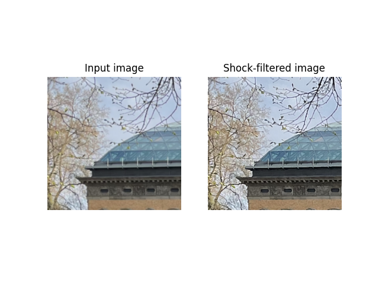

# (Chromatic) Shock Filter Python Implemenation



Requirements:
```
numpy>=1.22.3
scipy>=1.8.0
imageio>=2.16.1
```

Inspired by the following MATLAB implementation:
https://www.mathworks.com/matlabcentral/fileexchange/29593-shock-filtering-in-matlab

### References:
[1] Osher, Stanley, and Leonid I. Rudin. "Feature-oriented image enhancement using shock filters." SIAM Journal on numerical analysis 27.4 (1990): 919-940.

[2] Schuler, Christian J., et al. "Blind correction of optical aberrations." European Conference on Computer Vision. Springer, Berlin, Heidelberg, 2012.
   